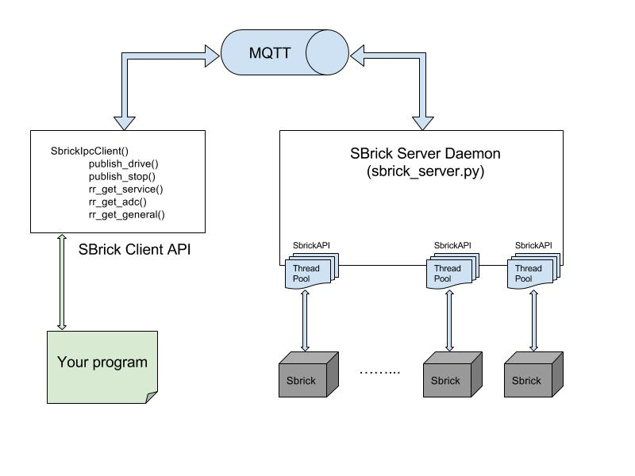

# SBrickPy
This is a python based interface to control SBrick-enabled Lego vehicles, and ultimately make them autonomous with a webcam.
  
A thread is created to handle a LEGO power function (a channel), and this means you can control LEGO power functions concurrently. The last drive function will overwrite the execution time of the related power function that is applied previously.

SBrick-Framework is implemented by `BlueZ + SBrick protocol + libuv + MQTT protocol + mosquitto broker`, and the code is tested by python 3.4 on Raspberry Pi 3(Raspbian Jessie). <br />

Aarchitecture overview: <br />



## SBrick Protocol
SbrickAPI is based on SBrick protocol 17 (https://social.sbrick.com/wiki/view/pageId/11/slug/the-sbrick-ble-protocol)


## Requirements
* Python 3.4
* BlueZ
* bluepy
* pyuv
* paho-mqtt
* mosquitto

### BlueZ
BlueZ is a official Bluetooth protocol stack on Linux.<br />
Useful commands for BlueZ:
```bash
$ hciconfig -a
$ sudo hciconfig hci0 up
$ sudo hcitool lescan
$ bluetoothctl
```
Must make sure bluetooth control is active.
```bash
$ sudo hciconfig hci0 up
```

## Prerequesites
```bash
$ ping raspberrypi.local
```
# And you should see results like this:
PING raspberrypi.local (192.168.1.11): 56 data bytes
64 bytes from 192.168.1.11: icmp_seq=0 ttl=64 time=12.195 ms
64 bytes from 192.168.1.11: icmp_seq=1 ttl=64 time=155.695 ms
64 bytes from 192.168.1.11: icmp_seq=2 ttl=64 time=49.939 ms
64 bytes from 192.168.1.11: icmp_seq=3 ttl=64 time=31.751 ms


### bluepy
bluepy is a Python module which provides an interface to Bluetooth LE on Linux.<br />
Ref: https://github.com/IanHarvey/bluepy
```bash
$ sudo pip3 install bluepy
```

### pyuv
pyuv is a Python module which provides an interface to libuv.<br />
Ref: https://github.com/saghul/pyuv
```bash
$ sudo pip3 install pyuv
```

### paho-mqtt
paho-mqtt is a Python module which provides an interface to MQTT protocol.<br />
Ref: https://pypi.python.org/pypi/paho-mqtt/1.2.3
```bash
$ sudo pip3 install paho-mqtt
```

### mosquitto
mosquitto is an open source message broker thant implements MQTT protocol versions 3.1 and 3.1.1<br />
Ref: https://mosquitto.org/
```bash
$ apt-get install mosquitto mosquitto-clients
$ sudo systemctl status mosquitto
$ sudo systemctl start mosquitto
$ sudo systemctl enable mosquitto
```


## Usage
### Start SBrick daemon:
1. Usage of `sbrick_server.py`
```bash
$ python3 sbrick_server.py -h
usage: sbrick_server.py [-h] (--connect | --scan) [--broker-ip BROKER_IP]
                        [--broker-port BROKER_PORT]
                        [--sbrick-id SBRICK_ID [SBRICK_ID ...]]
                        [--log-level LOG_LEVEL]

optional arguments:
  -h, --help            show this help message and exit
  --connect             Connect to SBrick
  --scan                Scan for getting SBrick information

--connect:
  --broker-ip BROKER_IP
                        MQTT broker ip address. Default is 127.0.0.1
  --broker-port BROKER_PORT
                        MQTT broker port. Default is 1883
  --sbrick-id SBRICK_ID [SBRICK_ID ...]
                        list of SBrick MAC to connect to
  --log-level LOG_LEVEL
                        Log verbose level. Default is INFO. [DEBUG | INFO |
                        WARNING | ERROR | CRITICAL]
```

2. Scan SBrick devices. You can get SBrick MAC in this step. (must run as root)
```bash
$ sudo python3 sbrick_server.py --scan
$ sudo hcitool lescan
```
You should find a device with name SBrick

3. Start daemon server with connecting to a SBrick device. (must run as root)
```bash
$ sudo python3 sbrick_server.py --connect --broker-ip 127.0.0.1 --broker-port 1883 --log-level debug --sbrick-id 11:22:33:44:55:66
```

4. You can also control multiple SBrick devices. The usage is below:
```bash
$ sudo python3 sbrick_server.py --connect ..... --sbrick-id <SBrick1 MAC> <SBrick2 MAC> <SBrick3 MAC>
```

### Code example of using SBrick Client API
See `go.py` for short example of `SbrickIpcClient` class

### Check Videofeed

You can use the following commands to check correct positioning of camera, potential obstruction and any other issues. Note however that a live videofeed will have lag and dropped frames, depending on your frame size, color depth and wireless performance.

On Raspberry pi

$ raspivid -t 0 -l -o tcp://0.0.0.0:3333

On computer:

vlc tcp/h264://192.168.1.13:3333

### Learning

$ sudo python3 sbrick_server.py --connect --broker-ip 127.0.0.1 --broker-port 1883 --log-level debug --sbrick-id 88:6B:0F:43:A9:35
$ sudo python3 drive_api.py -s 50
$ sudo python3 record.py


## SBrick Client API
`SbrickIpcClient` class has below methods:
* __SbrickIpcClient()__
  * Init class
  * _Parameters_:
    * `logger`       : logger object. logging. Default is sys.stdout
    * `broker_ip`    : string.        IP address of MQTT. Default is 127.0.0.1
    * `broker_port`  : number.        Port number of MQTT. Default is 1883
* __publish_dirve()__
  * Drive s LEGO power function
  * _Parameters_:
    * `sbrick_id`    : string. SBrick mac address. 11:22:33:44:55:66
    * `channel`      : string. hex_string. the LEGO power function port you want to drive. 00, 01, 02, 03
    * `direction`    : string. clockwise or counterclockwise. hex_string. 00, 01
    * `power`        : string. hex_string. 00 ~ FF
    * `exec_time`    : number. the executing time of LEGO power function in seconds, 5566 means forever
  * _Return_:
    * No return
* __publish_stop()__
  * Stop LEGO power functions
  * _Parameters_:
    * `sbrick_id`    : string. SBrick mac address. 11:22:33:44:55:66
    * `channel_list` : list.   list of channels to stop. [00, 01]
  * _Return_:
    * No return
* __rr_get_service()__
  * Get information of UUID, services and characteristis of a SBrick device
  * _Parameters_:
    * `sbrick_id`    : string. SBrick mac address. 11:22:33:44:55:66
    * `timeout`      : number. timeout to get service in seconds.
  * _Return_:
    * Information in JSON format.
    * `ret_code`: 100(success), 220(bad_param), 300(timeout)
* __rr_get_adc()__
  * Get information of voltage and temperature of a SBrick device
  * _Parameters_:
    * `sbrick_id`    : string. SBrick mac address. 11:22:33:44:55:66
    * `timeout`      : number. timeout to get service in seconds.
  * _Return_:
    * Information in JSON format.
    * `ret_code`: 100(success), 220(bad_param), 300(timeout)
* __rr_get_general()__
  * Get general information of a SBrick device
  * _Parameters_:
    * `sbrick_id`    : string. SBrick mac address. 11:22:33:44:55:66
    * `timeout`      : number. timeout to get service in seconds.
  * _Return_:
    * Information in JSON format.
    * `ret_code`: 100(success), 220(bad_param), 300(timeout)

